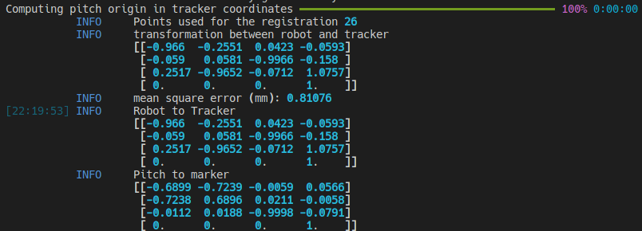
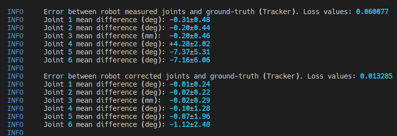

# Improving the Accuracy of Minimally-Invasive Surgical Robots 

### Paper (UNDER REVIEW) | [Video](https://youtu.be/NmkAzrD-UCo)


This repository contains the code implementation and data for a joint estimation and calibration algorithm used to improve the kinematic accuracy of surgical robots . The goal of the joint estimation algorithm is to convert the location of optical markers attached to the robot into a new set of joint values that better describe the robot pose. Using this new set of joints, a neural network model can be then trained to improve the robot accuracy. For more details, please refer to the paper.
## Installation instructions

All the main functions from this project were organized into a python module which you can install with 

```
pip install -r requirements.txt
pip install -e .
```

or by creating a new conda environment with 
```
conda env create -f environment.yml
```

After installing the module, open a python terminal and write 

```
import kincalib
```

to ensure the module was correctly installed. The additional torch dependencies and data download can be easily obtained with the `install-dependencies.sh` script.


### Training of neural networks dependencies (Optional)
To train the neural networks with the code provided you will need to additionally install the [Torch-suite](https://github.com/jabarragann/torch-suite) module and pytorch dependencies with

```
pip install -r requirements_torch.txt
git clone https://github.com/jabarragann/torch-suite.git --recursive
cd torch-suite
git checkout ff68b04
pip install -e .
pip install -e ./pytorch-checkpoint/
```
## Data download

The data for this project is publicly available in a Kaggel dataset. To download it, we recommend using the official kaggle-api ([link](https://github.com/Kaggle/kaggle-api))

```
kaggle datasets download -d juanantoniobarragan/kinematic-calibration-of-surgical-robots
unzip kinematic-calibration-of-surgical-robots.zip
```

## Code overview
The proposed solution is divided into 3 main steps: (1) calibration, (2) calculation of corrected joints and (3) neural network correction. These steps can be followed by using the sampled data and scripts below.

### Calibration script

The goal of the calibration step is to find the location of the optical markers with respect to the robot kinematic frames and the transformation between the robot and the tracker.

```
python scripts/01_calibration_exp/02_robot_tracker_calibration.py -r icra2023-data/d04-rec-20-trajsoft/ --reset
```

Output of calibration script




### Calculation of corrected joints 

Calculate the corrected joint values for all the test trajectories. Corrected joint values have already been provided in the dataset. 

```
python scripts/01_calibration_exp/04_calculate_ground_truth_jp.py -r icra2023-data/d04-rec-20-trajsoft/ -t --testid 1 2 3 4 5 6 7 20 21 22 23 24 25 26 --reset
```

This script is not fully optimize, so calculating all the corrected joint values for all the test trajectories will take around an hour. Summary statistics of the new joint values can be observed with the previous script without the `--reset` flag. The sample output from the script is

```
**Evaluation report for test trajectory 1 in registration_results**
* Registration path: icra2023-data/d04-rec-20-trajsoft/registration_results/registration_values.json
Difference from ground truth (Tracker values) (N=171)

|       | q1 (deg)   | q2 (deg)   | q3 (mm)    | q4 (deg)   | q5 (deg)   | q6 (deg)   | cartesian (mm) |
| ----- | ---------- | ---------- | ---------- | ---------- | ---------- | ---------- | -------------- |
| robot | +0.34±0.21 | +0.43±0.28 | +0.40±0.24 | +3.91±1.73 | +8.65±3.29 | +6.72±3.17 | +5.87±1.51     |

Registration error (FRE) (N=171)

| type    | FRE (mm)   |
| ------- | ---------- |
| robot   | +1.25±0.52 |
| tracker | +0.38±0.18 |
```

### Neural network training 

**Dataset creation**
```
python scripts/02_learning_scripts/create_dataset.py
# Clean tracker false detections
python scripts/02_learning_scripts/clean_dataset.py
```

The previous to script will generate two csv files with the necessary data to train the neural networks model. For training, use the clean dataset file. To find more information about what each column of the dataset file mean refer to the LearningRecord class documentation in [link](https://github.com/jabarragann/ComplianceProject/blob/540cc2947f3824fadca0260b0b9aa5c9c0de7d3f/kincalib/Recording/DataRecord.py#L309-L329).

**Neural network training**
```
python scripts/02_learning_scripts/train_simple_model.py
```

This script will generate a directory with the weights, normalization values, and training plots. After training the network you should see an error reduction in all the joints as shown below.




## Reproducing paper results 

**Reproducing freespace results**

To reproduce the freespace results run the script below.
```
python3 scripts/01_calibration_exp/07_plot_corrected_joints.py -r ./icra2023-data/d04-rec-20-trajsoft/ --testid 3 7 26 -t -m ./icra2023-data/neuralnet/model
```

which results in the following output

```
**Evaluation report for test trajectory 3 in d04-rec-20-trajsoft**
* Registration path: icra2023-data/d04-rec-20-trajsoft/registration_results
* model path: icra2023-data/neuralnet/model

Difference from ground truth (Tracker values) (N=172)

|         | q1 (deg)   | q2 (deg)   | q3 (mm)    | q4 (deg)   | q5 (deg)    | q6 (deg)   | cartesian (mm) |
| ------- | ---------- | ---------- | ---------- | ---------- | ----------- | ---------- | -------------- |
| robot   | +0.52±0.25 | +0.28±0.19 | +0.44±0.32 | +4.45±1.91 | +8.06±10.53 | +9.71±9.51 | +6.19±3.20     |
| network | +0.09±0.07 | +0.08±0.06 | +0.44±0.32 | +0.73±0.55 | +2.21±10.38 | +2.37±8.12 | +1.44±3.18     |

Registration error (FRE) (N=172)

| type    | FRE (mm)   |
| ------- | ---------- |
| robot   | +1.93±1.61 |
| tracker | +0.72±0.31 |
| network | +1.08±1.54 |
```

**Reproducing phantom results**

To reproduce the phantom results, first calculate the corrected joint values with

```
python scripts/01_calibration_exp/04_calculate_ground_truth_jp.py -r icra2023-data/d04-rec-20-trajsoft/ -t --testid 1 2 3 4 5 --datadir icra2023-data/d04-rec-20-trajsoft/registration_exp/registration_with_phantom/ --reset
```

Then generate registration results with

```
python scripts/01_calibration_exp/new_08_analyze_reg_experiment.py  -r icra2023-data/d04-rec-20-trajsoft/ --modelpath icra2023-data/neuralnet/model/
```