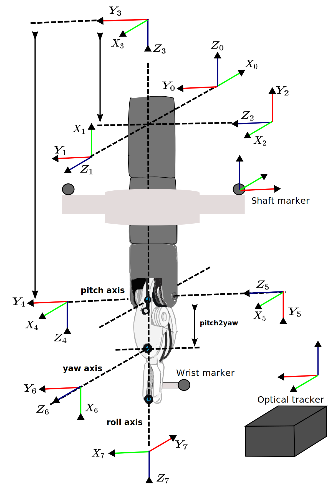

# Calibration procedure

The calibration procedure goal's is finding corrected joints values that more accurately describe the robot's end-effector position. These corrected joint values can later be used to train deep learning networks for intraoperative kinematic error reduction. The calibration is divided into 2 steps: the registration of the tracker and robot's coordinate frames and the calculation of the corrected joint values. The first step is achieved by commanding the robot to different locations and by recording the wrist pitch frame's origin in both robot and tracker coordinates. This procedure generates two point clouds that can be used to rigidly register the tracker and the robot. After registration, the corrected joint values are calculated using geometric algorithms based on the robot's Denavit-Hartenberg (DH) kinematic parameters.  

## Notation

Let $q_i$ be the ith measured joint value of the robot which can be obtained by reading the robot's encoders. Let $\hat{q_i}$ be the ith estimated joint value using the geometric information provided by the optical tracker. This value is assumed to be different from $q_i$ due to non-linearities introduced by the cable-driven mechanisms. In general, we will use the $\:\hat{}\:$ symbol to refer to quantities estimated using the geometric information of the tracker. To describe the relative position of coordinate $i$ with respect to $i-1$, we will use the notation ${}^{i-1}T_{i}$. Lastly, all the vectors will have a upper superscript indicating the frame to which they are referenced, e.g., $p^{\{i\}}$. 

## Robot kinematic model and optical markers locations 

The DVRK robot utilices the modified denavit-Hartenberg parameters to describe the relative position of successives joint axis. With this convention the position of the link $i$ relative to link $i-1$ can be described with

$${}^{i-1}T_{i} = R_x(\alpha_{i-1}) \: T_x(a_{i-1}) \: T_z(\delta_i) \: R_z(\theta_i)$$

where $R_x$ and $R_z$ are rotation matrices a about x and z axis, and $T_x$ and $T_z$ are translation matrices along the x and z axis. Figure XX shows the different frames describing the robot's kinematic chain. Frames 1 to 6 represented the robot's actuated joints while the coordinate frame $0$ and $1$ represent the robot's base and end-effector system, respectively. The notation $f_{kins}(q_0,..,q_i)$ will be used to describe robot's forward kinematic function. This function will describe the transformation ${}^{0}T_{i}$. 

For the calibration procedure, two optically tracked object are attached to the robot. The first object is a single marker which is attached to the last link of the robot. We will refer to this marker's location tracker coordinates as $p_{wrist}^{\{T\}}$. This marker is attached such that its position is constant from the robots $6$th frame. The second object is a 3D printed part containing 3 optical markers. This part is attached to the robot's shaft such that the transformation ${}^{4}T_{M}$ is constant. Lastly, the position of this part with respect to the tracker is defined as ${}^{T}T_{M}$ and can be measured using the tracker. 

## Pitch origin calculation & Robot-tracker registration 

Robot-tracker registration requires knowing corresponding pair of points in both robot and tracker frame. To construct these point clouds, we decided to use the origin of the pitch frame as it can be easily calculated from both coordinate frames. $p_{pi}^{\{r\}}$ can be calculated using the forward kinematic formulas shown in the equation below. This formula will require the first three measured joint values from the robot, however, previous work [HWANG] have shown that these joints have negligeble error compared to the wrist joints. In this regard, it will be admisible to use this joint values to find the registration between the robot and tracker.

$$
\mathbf{p_{pi}^{\{r\}}} = \left[\begin{array}{l}
x_{pi} \\
y_{pi} \\
z_{pi}
\end{array}\right] = \left[ \begin{array}{c}
\cos(q_2) \cdot \sin(q_1)  \cdot (L_{tool}-L_{RCC}+q_3) \\
-\sin(q_2) \cdot (L_{tool}-L_{1}+q_3) \\
-\cos(q_1) \cdot \cos(q_2) \cdot (L_{tool}-L_{RCC}+q_3)
\end{array}\right]
$$

To calculate $p_{pi}^{\{r\}}$, we rely on the fact that the pitch origin's lies in the intersection between the roll and pitch axis (see figure [REF]). In reality, these two axis will rarely intersect and are more appropriately model as a pair of skew lines. In this case, we locate the pitch axis in the midpoint of the unique perpendicular segmented to both axis (SEE FIGURE). With these observation in mind, we can obtain ($T_{pi}^{T}$) by first  calculating the line equations defining the roll and pitch axis in tracker frame and secondly by finding the midpoint of the perpendicular segment. To obtain the line equation of each rotation axis, the corresponding joint was moved in small increments while keeping the rest of the joints still. As the tracked markers were rigidly attached to the robot, the movement of a single joint produced a point cloud following a circular trajectory. The line equation of the desired axis of rotation could be then obtained with the center and perpendicular vector of 3D circle fitted to this point cloud. 

Finally, the registration matrix $T_{RT}$ can be obtained by moving the robot to multiple locations and calculating $p_{pi}^{\{r\}}$ and $p_{pi}^{\{T\}}$ at each step. After collecting enough points, $T_{RT}$ was calculated using a point-cloud to point-cloud registration method based on SVD decomposition.

[DOES USING TWO DIFFERENT PITCH AXIS FOR THE CALCULATION OF THE PITCH ORIGIN IS REALLY HELPING? INVESTIGATE WHETHER USING TWO PITCH AXIS IMPROVES THE REGISTRATION ERROR]

[MIDPOINT OF SHORTEST SEGMENT]

## Joint calculation 

### Base and insertion joints estimation ($\hat{q}_1$, $\hat{q}_2$ and $\hat{q}_3$)

### Shaft rotation estimation ($q_4$)

### Wrist joints estimation ($q_5$ and $q_6$)

Inverse kinematics for the first three joints

$$
\left[\begin{array}{c}
q_{\mathrm{p}, 1} \\
q_{\mathrm{p}, 2} \\
q_{\mathrm{p}, 3}
\end{array}\right]=\left[\begin{array}{c}
\arctan 2\left({ }_{5}^{0} x /-{ }_{5}^{0} z\right) \\
\arctan 2\left(-{ }_{5}^{0} y / \sqrt{{ }_{5}^{0} x^{2}+{ }_{5}^{0} z^{2}}\right) \\
\sqrt{{ }_{5}^{0} x^{2}+{ }_{5}^{0} y^{2}+{ }_{5}^{0} z^{2}}+L_{1}-L_{\mathrm{tool}}
\end{array}\right],
$$

<!--  -->

Figure 1

# Supplemtary material 

## 3D circle fitting

## Finding line segment orthogonal to two skew 3D lines 

## Closest distance from circle to circle

## OLD IDEAS

Although these formulas require measured joint values from the robot, previous work  showed that most of the kinematic error in the DVRK robot is mostly due to the the wrist joints. In this regard, the first three joints can be used to calculated the registration between the robot and the tracker without introducing too much error. 

The pitch origin's position in tracker space ($T_{pi}^{T}$) we model the roll and pitch axis as a pair of skew lines (In an ideal robot these two axes would intersect each other at a point) can be calculated as the midpoint of a the perpendicular segmented to both the roll and pitch axis in tracker space. In the robot kinematic models these two axis  

$\hat{q}$ 
The resulting points clouds can then be rigidly registered to obtain $T_{RT}$. 

The robot's DH parameters and link coordinate frames can be observed in the figure [XX]. Given the parameters the parameters of the link containing axis $i-1$ and $i$, The DVRK robot uses the modified DH parameter convention and therefore the transformation between two successives link frames is described by 

To obtain the transformation ${}^{0}T_{i}$ we will be using the notation $f_{kins}(q_0,..,q_i)$ where $f_{kins}$ is the robot's forward kinematic function. 

For calibration purposes, two sets of optical markers are attached to the robot. The first set is a single marker is attached to the robot's last link. The location of this marker in tracker coordinates frames will be $p_{wrist}^{\{T\}}$. The second set is a 3d printed part containing 3 markers that is attached to the robot shaft. The transformation the 3D printed part's origin relative to the tracker ${}^{T}T_{M}$. 
