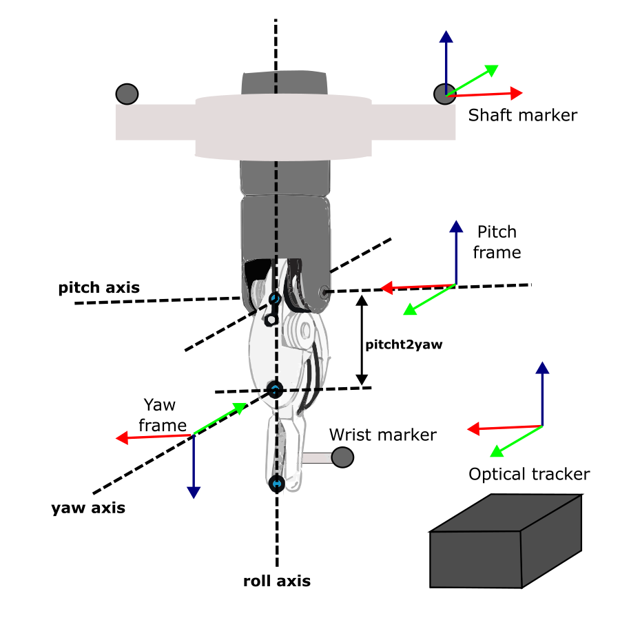

# Calibration procedure

The calibration procedure goal's is finding corrected joints values $\hat{q}$ that more accurately describe the robot's end-effector position. These corrected joint values can later be used to train deep learning networks to automatically correct the joint values without the optical tracker. The calibration is divided into 3 main steps. The identification of the pitch frame's origin, the registration from the tracker to the robot ($T_{RT}$) and the calculation of the corrected joint values. To calculate $T_{RT}$, the robot is commanded to different locations and at each point the pitch frame's origin is recorded in the robot coordinate frame and the tracker coordinate frame. The resulting points clouds can then be rigidly registered to obtain $T_{RT}$. The calculation of the corrected joints is also breaked down into three different calculations, one for $\hat{q_1}$,$\hat{q_2}$ and $\hat{q_2}$, another one for $\hat{q_3}$, and another for $\hat{q_5}$ and $\hat{q_6}$. 

## Robot tracker registration 

Robot-tracker registration requires knowing corresponding pair of points in both robot and tracker frame. To construct these point clouds, we decided to use the origin of the pitch frame as it can be easily calculated from both coordinate frames (TALK ABOUT HOW PREVIOUS WORK SHOWED THAT THE FIRST THREE JOINTS OF THE ROBOT ARE VERY PRECISE, SO REGISTRATION WILL NOT HAVE MUCH ERROR FROM ROBOT VALUES). The pitch origin in the robot frame can be calculated using the inverses kinematic formulas shown in the equations below. 

$$
x= y^2
$$

## Joint calculation 

<!--  -->

