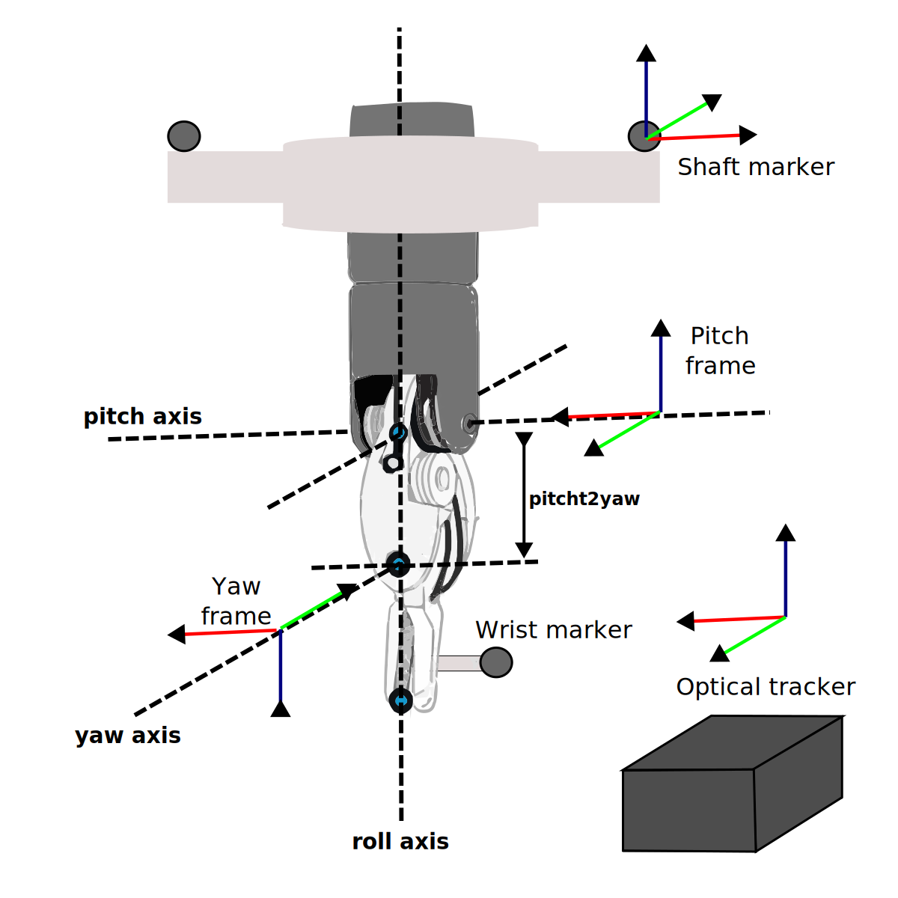

# Calibration procedure

The calibration procedure goal's is finding corrected joints values $\hat{q}$ that more accurately describe the robot's end-effector position. These corrected joint values can later be used to train deep learning networks to reduce the robot's kinematic error without the optical tracker. The calibration is divided into 2 main steps: The registration from the tracker to the robot ($T_{RT}$) and the calculation of the corrected joint values $\hat{q}$. To calculate $T_{RT}$, the robot is commanded to different locations and at each point the pitch frame's origin is recorded in the robot coordinate frame and the tracker coordinate frame. The resulting points clouds can then be rigidly registered to obtain $T_{RT}$. The calculation of the corrected joints is also breaked down into three different calculations, one for $\hat{q_1}$,$\hat{q_2}$ and $\hat{q_2}$, another one for $\hat{q_3}$, and another for $\hat{q_5}$ and $\hat{q_6}$. 

## Notation

## Pitch origin calculation & Robot-tracker registration 

Robot-tracker registration requires knowing corresponding pair of points in both robot and tracker frame. To construct these point clouds, we decided to use the origin of the pitch frame as it can be easily calculated from both coordinate frames. $p_{pi}^{\{r\}}$ can be calculated using the forward kinematic formulas shown in the equation below. This formula will require the first three measured joint values from the robot, however, previous work [HWANG] have shown that these joints have negligeble error compared to the wrist joints. In this regard, it will be admisible to use this joint values to find the registration between the robot and tracker.

$$
\mathbf{p_{pi}^{\{r\}}} = \left[\begin{array}{l}
x_{pi} \\
y_{pi} \\
z_{pi}
\end{array}\right] = \left[ \begin{array}{c}
\cos(q_2) \cdot \sin(q_1)  \cdot (L_{tool}-L_{RCC}+q_3) \\
-\sin(q_2) \cdot (L_{tool}-L_{1}+q_3) \\
-\cos(q_1) \cdot \cos(q_2) \cdot (L_{tool}-L_{RCC}+q_3)
\end{array}\right]
$$

To calculate $p_{pi}^{\{r\}}$, we rely on the fact that the pitch origin's lies in the intersection between the roll and pitch axis (see figure [REF]). In reality, these two axis will rarely intersect and are more appropriately model as a pair of skew lines. In this case, we locate the pitch axis in the midpoint of the unique perpendicular segmented to both axis (SEE FIGURE). With these observation in mind, we can obtain ($T_{pi}^{T}$) by first  calculating the line equations defining the roll and pitch axis in tracker frame and secondly by finding the midpoint of the perpendicular segment. To obtain the line equation of each rotation axis, the corresponding joint was moved in small increments while keeping the rest of the joints still. As the tracked markers were rigidly attached to the robot, the movement of a single joint produced a point cloud following a circular trajectory. The line equation of the desired axis of rotation could be then obtained with the center and perpendicular vector of 3D circle fitted to this point cloud. 

Finally, the registration matrix $T_{RT}$ can be obtained by moving the robot to multiple locations and calculating $p_{pi}^{\{r\}}$ and $p_{pi}^{\{T\}}$ at each step. After collecting enough points, $T_{RT}$ was calculated using a point-cloud to point-cloud registration method based on SVD decomposition.

[DOES USING TWO DIFFERENT PITCH AXIS FOR THE CALCULATION OF THE PITCH ORIGIN IS REALLY HELPING? INVESTIGATE WHETHER USING TWO PITCH AXIS IMPROVES THE REGISTRATION ERROR]

[MIDPOINT OF SHORTEST SEGMENT]

## Joint calculation 

Inverse kinematics for the first three joints

$$
\left[\begin{array}{c}
q_{\mathrm{p}, 1} \\
q_{\mathrm{p}, 2} \\
q_{\mathrm{p}, 3}
\end{array}\right]=\left[\begin{array}{c}
\arctan 2\left({ }_{5}^{0} x /-{ }_{5}^{0} z\right) \\
\arctan 2\left(-{ }_{5}^{0} y / \sqrt{{ }_{5}^{0} x^{2}+{ }_{5}^{0} z^{2}}\right) \\
\sqrt{{ }_{5}^{0} x^{2}+{ }_{5}^{0} y^{2}+{ }_{5}^{0} z^{2}}+L_{1}-L_{\mathrm{tool}}
\end{array}\right],
$$

<!--  -->

Figure 1

# Supplemtary material 

## 3D circle fitting

## Finding line segment orthogonal to two skew 3D lines 

## Closest distance from circle to circle

## OLD IDEAS

Although these formulas require measured joint values from the robot, previous work  showed that most of the kinematic error in the DVRK robot is mostly due to the the wrist joints. In this regard, the first three joints can be used to calculated the registration between the robot and the tracker without introducing too much error. 

The pitch origin's position in tracker space ($T_{pi}^{T}$) we model the roll and pitch axis as a pair of skew lines (In an ideal robot these two axes would intersect each other at a point) can be calculated as the midpoint of a the perpendicular segmented to both the roll and pitch axis in tracker space. In the robot kinematic models these two axis  
