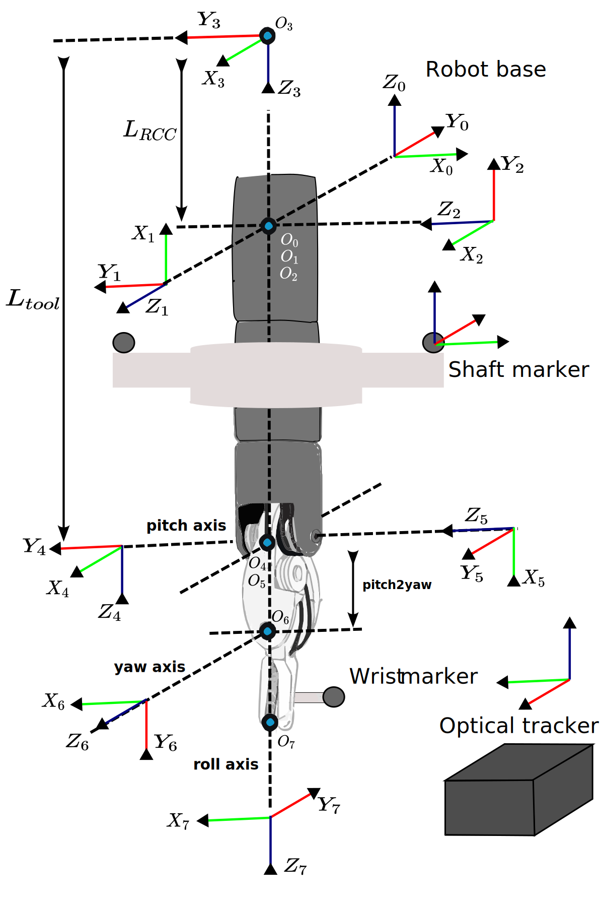

# Calibration procedure

The calibration procedure goal's is finding corrected joints values that more accurately describe the robot's end-effector position. These corrected joint values can later be used to train deep learning networks for intraoperative kinematic error reduction. The calibration is divided into 2 steps: the registration of the tracker and robot's coordinate frames and the calculation of the corrected joint values. The first step is achieved by commanding the robot to different locations and by recording the wrist pitch frame's origin in both robot and tracker coordinates. This procedure generates two point clouds that can be used to calculate the spatial transformation between rigidly register the tracker and the robot. After registration, the corrected joint values are calculated using geometric algorithms based on the robot's Denavit-Hartenberg (DH) kinematic parameters.  

## Notation

Let $q_i$ be the ith measured joint value of the robot which can be obtained by reading the robot's encoders. Let $\hat{q_i}$ be the ith estimated joint value using the geometric information provided by the optical tracker. This value is assumed to be different from $q_i$ due to non-linearities introduced by the cable-driven mechanisms. In general, we will use the $\:\hat{}\:$ symbol to refer to quantities estimated using the geometric information of the tracker. To describe the relative position of coordinate $i$ with respect to $i-1$, we will use the notation ${}^{i-1}T_{i}$, where $T$ is an $4\times4$ homogenous transformation matrix. Lastly, all the vectors will have a upper superscript indicating the frame to which they are referenced, e.g., $p^{\{i\}}$. 

## Robot kinematic model and optical markers locations 

The DVRK robot utilices the modified denavit-Hartenberg parameters to describe the relative position of successives joint axis. With this convention the position of the joint axis $i$ relative to joint axis $i-1$ can be described with

$${}^{i-1}T_{i} = R_x(\alpha_{i-1}) \: T_x(a_{i-1}) \: T_z(\delta_i) \: R_z(\theta_i)$$

where $R_x$ and $R_z$ are rotation matrices a about x and z axis, and $T_x$ and $T_z$ are translation matrices along the x and z axis. Figure XX shows the different frames describing the robot's kinematic chain. Frames 1 to 6 represented the robot's actuated joints while the coordinate frame $0$ and $1$ represent the robot's base and end-effector system, respectively. The notation $f_{kins}(q_0,..,q_i)$ will be used to describe robot's forward kinematic function. This function will describe the transformation ${}^{0}T_{i}$. 

For the calibration procedure, two optically tracked object are attached to the robot. The first object is a single marker which is attached to the last link of the robot. We will refer to this marker's location as $p_{wrist}$. This marker is attached such that its position is constant from the robot's $6$th frame. The second tracked object is a 3D printed part containing 3 optical markers. This part is attached to the robot's shaft such that the transformation ${}^{4}T_{M}$ is constant. Both ${}^{T}T_{M}$ and $p_{wrist}^{\{T\}}$ can be obtained using the tracker API.

## Robot-tracker registration 

Robot-tracker registration was achieved by calculating the wrist pitch axis origin $\left(p_{O5}\right)$ in the robot and tracker's coordinate frame. The former calculated using the robot's kinematic equations and the later using the optically tracked objects. These measurements were performed at multiple random joint configuration while the robot was completely still to avoid synchronization issues between robot and tracker information. After collecting N different configurations, the spatial transformation ${}^{0}T_{T}$ was found then by  minimizing the distance between all corresponding pair of points. This least-squares solution was obtained using an SVD based aproach. $P_{O5}^{\{0\}}$ was calculated using the robot's forward kinematic formulation shown in the equation [XX]. Although this formula will require the first three measured joint values from the robot, previous work [HWANG] showed that these joints have negligeble error compared to the wrist joints and therefore can be used for the registration process.

$$
\mathbf{p_{O5}^{\{0\}}} = \left[\begin{array}{l}
x_{O5} \\
y_{O5} \\
z_{O5}
\end{array}\right] = \left[ \begin{array}{c}
\cos(q_2) \cdot \sin(q_1)  \cdot (L_{tool}-L_{RCC}+q_3) \\
-\sin(q_2) \cdot (L_{tool}-L_{1}+q_3) \\
-\cos(q_1) \cdot \cos(q_2) \cdot (L_{tool}-L_{RCC}+q_3)
\end{array}\right]
$$

Using the robot's kinematic model, $P_{O5}$ can be alternatively defined as the intersection point between the roll and pitch axis (see figure [REF]). In reality, these two axis will rarely intersect and are more appropriately model as a pair of skew lines. In this case, $P_{O5}$ can be defined as the midpoint of the unique mutual perpendicular segmented to both axis (SEE FIGURE: MAYBE SHOWING THE TWO AXIS AND THE MIDPOINT). Using this observation $P_{O5}^{\{T\}}$ can be calculated by obtaining the line equations defining the roll and pitch axis in tracker frame and then finding the midpoint of the perpendicular segment. The line equation of each rotation axis was obtained by moving the corresponding joint in small increments while keeping the rest of the joints still. As the tracked markers were rigidly attached to the robot, the movement of a single joint produced a point cloud along a circular trajectory. The line equation of the desired axis of rotation was then obtained with the center and perpendicular vector of 3D circle fitted to this point cloud. The rotation axis's direction was additionally used to compute the constant transformation ${}^{M}T_{4}$. This transformation was later used for the joint calculations.

Some
[DOES USING TWO DIFFERENT PITCH AXIS FOR THE CALCULATION OF THE PITCH ORIGIN IS REALLY HELPING? INVESTIGATE WHETHER USING TWO PITCH AXIS IMPROVES THE REGISTRATION ERROR]

[MIDPOINT OF SHORTEST SEGMENT]

## Joint calculation 

After registration the corrected joint values can be obtained by measuring ${}^{T}T_{M}$ and $P_{wrist}^{\{T\}}$ with the optical tracker. Based on these values, three algorithms are proposed to calculate the corrected joint values. 

### Base and insertion joints estimation ($\hat{q}_ 1$, $\hat{q}_ 2$ and $\hat{q}_ 3$)

The base and insertion joint estimation starts by calculating a corrected value of the wrist pitch frame's origin $\hat{P}_ {O5}^{\{0\}}$ using tracker measurements. This value was calculated by transforming $P_{O5}^{\{M\}}$ (known from calibration) to the robot coordinate frame using the following equation 

$$ \hat{P}_ {O5}^{\{0\}} = {}^{0}T_{T} {}^{T}T_{M} P_{O5}^{\{M\}}$$

Then, the inverse kinematics formula are applied to $\hat{P}_ {O5}^{0}$ to find the corrected joint values. 

$$
\left[\begin{array}{c}
\hat{q}_ {1} \\
\hat{q}_ {2}  \\
\hat{q}_ {3} 
\end{array}\right]= f_{inv\_kin} \left( \hat{P}_ {O5}^{\{0\}} \right) = \left[\begin{array}{c} 
\arctan 2\left(x/- z\right) \\
\arctan 2\left(- y / \sqrt{x^{2}+z^{2}}\right) \\
\sqrt{ x^{2}+ y^{2}+ z^{2}}+L_{RCC}-L_{\mathrm{tool}}
\end{array}\right],
$$

### Shaft rotation estimation ($q_4$)

### Wrist joints estimation ($q_5$ and $q_6$)

Inverse kinematics for the first three joints

<!--  -->

Figure 1

# Supplemtary material 

## 3D circle fitting

## Finding line segment orthogonal to two skew 3D lines 

## Closest distance from circle to circle

## OLD IDEAS

Although these formulas require measured joint values from the robot, previous work  showed that most of the kinematic error in the DVRK robot is mostly due to the the wrist joints. In this regard, the first three joints can be used to calculated the registration between the robot and the tracker without introducing too much error. 

The pitch origin's position in tracker space ($T_{pi}^{T}$) we model the roll and pitch axis as a pair of skew lines (In an ideal robot these two axes would intersect each other at a point) can be calculated as the midpoint of a the perpendicular segmented to both the roll and pitch axis in tracker space. In the robot kinematic models these two axis  

$\hat{q}$ 
The resulting points clouds can then be rigidly registered to obtain $T_{RT}$. 

The robot's DH parameters and link coordinate frames can be observed in the figure [XX]. Given the parameters the parameters of the link containing axis $i-1$ and $i$, The DVRK robot uses the modified DH parameter convention and therefore the transformation between two successives link frames is described by 

To obtain the transformation ${}^{0}T_{i}$ we will be using the notation $f_{kins}(q_0,..,q_i)$ where $f_{kins}$ is the robot's forward kinematic function. 

For calibration purposes, two sets of optical markers are attached to the robot. The first set is a single marker is attached to the robot's last link. The location of this marker in tracker coordinates frames will be $p_{wrist}^{\{T\}}$. The second set is a 3d printed part containing 3 markers that is attached to the robot shaft. The transformation the 3D printed part's origin relative to the tracker ${}^{T}T_{M}$. 

Tracking this point across space resulted in two point clouds that were aligned using algorithm based on SVD to find ${}^{R}T_{T}$.

Robot-tracker registration requires knowing corresponding pair of points in both robot and tracker frame. To construct these point clouds, we decided to use the origin of the pitch frame as it can be easily calculated from both coordinate frames. 

$P_{O5}^{\{T\}}$ was calculated using the fact that the wrist pitch origin's $\left(P_{O5}\right)$ lies in the intersection between the roll and pitch axis in the robot's kinematic model (

With these observation in mind, we can obtain ($T_{O5}^{T}$) by first  calculating the line equations defining the roll and pitch axis in tracker frame and secondly by finding the midpoint of the perpendicular segment. 

ROBOT REGISTRATION IDEAS

Robot-tracker registration was achieved by calculating the wrist pitch axis origin $\left(p_{O5}\right)$ using the optically tracked objects while the robot was moving through random joint configurations. This procedure produced a point-cloud that was aligned to the values reported by the robot to find ${}^{0}T_{T}$. This spatial transformation was found by solving a least-squares problem using SVD. $P_{O5}^{\{0\}}$ was calculated using the robot's  forward kinematic formulation shown in the equation [XX]. [NOT SURE ABOUT THE FOLLOWING - This formula will require the first three measured joint values from the robot, however, previous work [HWANG] have shown that these joints have negligeble error compared to the wrist joints. In this regard, it will be admisible to use this joint values to find the registration between the robot and tracker.]

The robot was moved along a random  trajectory while making joint configuration and then stop completely before making the measurements.The robot followed a random was commanded to a random joint configuration and only after stopping completely  

solving a least-squares problem using SVD to minimize the distance between all the corresponding points. 

Finally, the registration matrix $T_{RT}$ can be obtained by moving the robot to multiple locations and calculating $p_{pi}^{\{r\}}$ and $p_{pi}^{\{T\}}$ at each step. After collecting enough points, $T_{RT}$ was calculated using a point-cloud to point-cloud registration method based on SVD decomposition.
